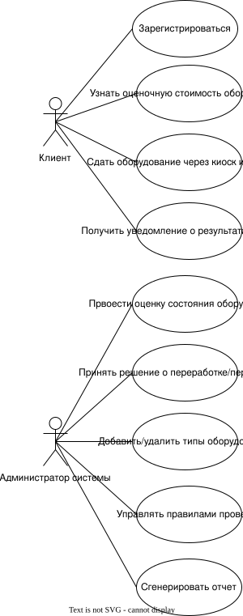

### Перечень заинтересованных лиц (стейкхолдеров)

1. Клиенты - индивидуальные пользователи, сдающие электронику через киоски или онлайн-систему. Заинтересованы в быстрой, удобной оценке и получении денег за оборудование.

2. Сотрудники компании - персонал, выполняющий инспекцию оборудования, оценку состояния и управление переработкой/перепродажей.

3. Руководство компании - лица, заинтересованные в прибыльности и конкурентоспособности бизнеса, минимизации рисков, обеспечении прозрачности операций.

---

### Перечень функциональных требований

1. Система должна предоставлять клиенту возможность получить оценку стоимости оборудования:

   - через веб-приложение;
   - через интерфейс киоска.

2. Система должна хранить актуальный список типов оборудования, доступных для сдачи.

3. Для каждого типа оборудования система должна поддерживать индивидуальные правила проверки и оценки.

4. Возможность добавления новых типов оборудования в систему.

5. Возможность удаления устаревших типов оборудования (неактуальных в течение года).

6. Система должна предоставлять отчёты о состоянии принятых товаров:

   - принято к переработке;
   - принято к перепродаже.

7. Уведомление клиента о результатах проверки и окончательной стоимости оборудования.

8. Регистрация и авторизация клиентов в системе.

---

### Диаграмма вариантов использования для функциональных требования

---

### Перечень сделанных предположений

1. Клиенты могут сдавать только небольшие личные устройства (телефоны, камеры, планшеты).

2. Срок хранения записей об устройствах — 1 год.

3. Оплата клиенту осуществляется через электронные кошельки или банковский перевод.

4. Инспекция проводится вручную сотрудниками, но базовая оценка автоматизирована.

5. Каждый тип оборудования имеет отдельные критерии проверки, разработанные заранее.

---

### Перечень нефункциональных требований

1. **Локализация**:

   - приложение возможно использовать на русском и английском языках.

2. **Надежность**:

   - в случае сбоя должна быть возможность восстановить все данные старше 24 часов.

3. **Производительность**:

   - приложение должно реагировать на любой пользовательский запрос не дольше, чем в течение 1 секунды при одновременном обращении 10 000 пользователей;
   - приложение должно в пике выдерживать обращение 50 000 пользователей при этом отвечать на запросы не дольше, чем за 5 секунд.

4. **Доступность** :
   - приложение должно быть доступно 99.9% времени в год.
