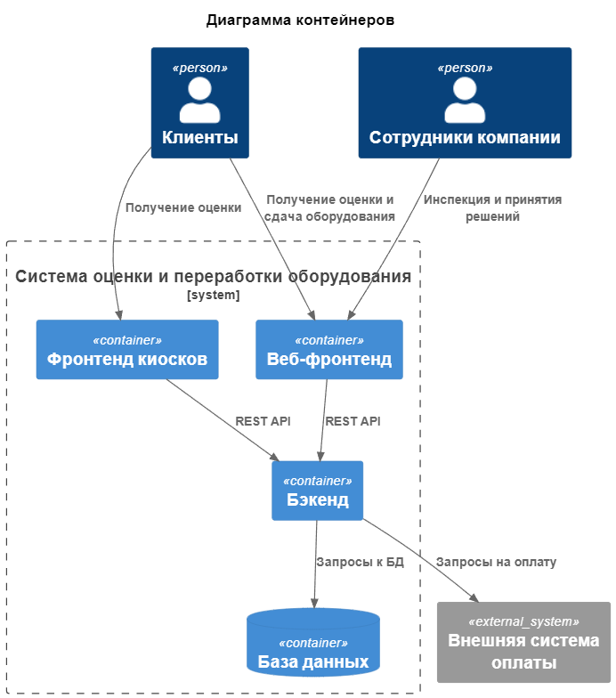
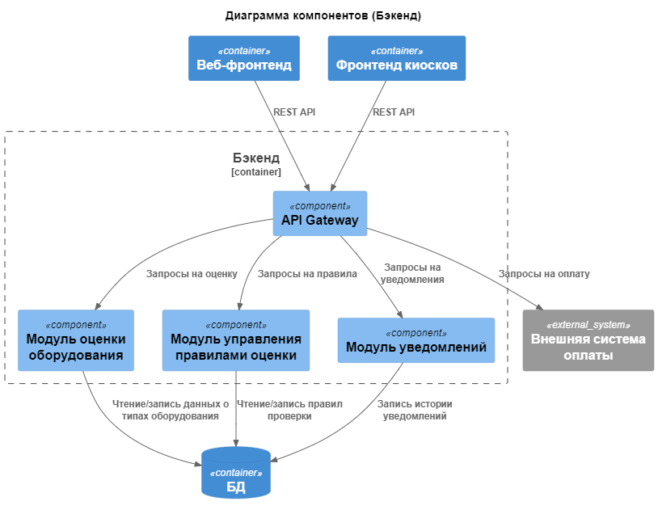
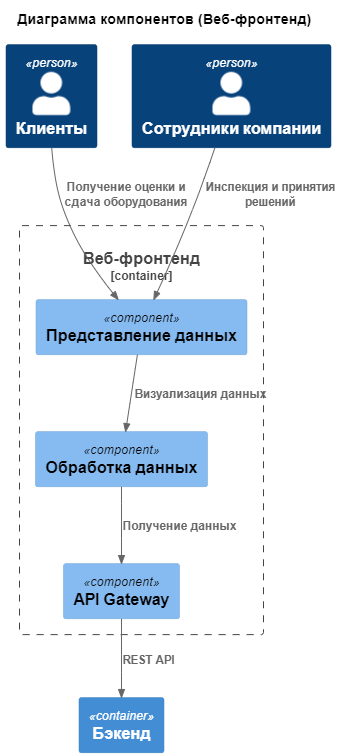
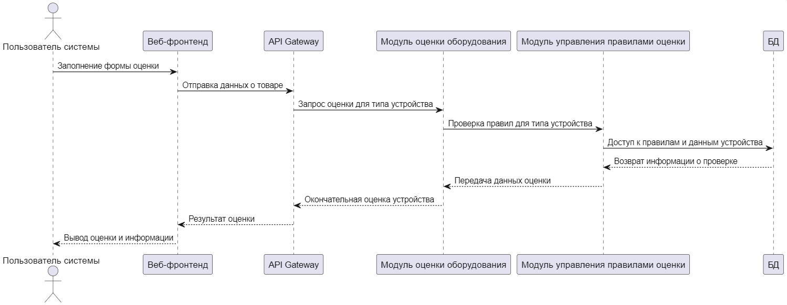
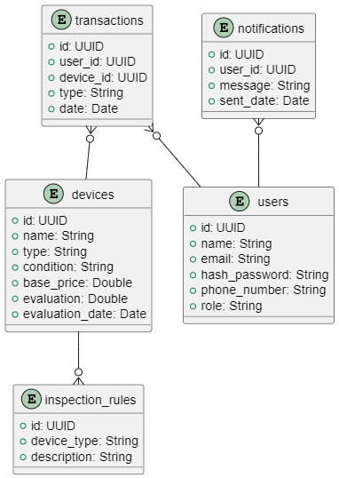

### Диаграмма контейнеров

Диаграмма контейнеров предоставляет архитектурную картину, показывающую, какие компоненты входят в систему и как они взаимодействуют друг с другом. В этом проекте рассматривается система оценки и переработки оборудования с веб-фронтендом, фронтендом киосков, бэкендом, базой данных и внешней системой.



### Диаграмма компонентов

В диаграмме компонентов показаны детали бэкенда системы, в том числе модули оценки оборудования, правила проверки, уведомлений и API Gateway. Эти компоненты реализуют основные сервисы, необходимые для функционирования системы.



На фронтенде есть компоненты для представления данных, обработки запросов и отображения визуальной информации. Взаимодействие с бэкендом осуществляется через API Gateway.



### Диаграмма последовательности

Диаграмма последовательности демонстрирует процесс оценки оборудования от заполнения формы пользователем до получения результата. Включает взаимодействие между клиентом, веб-фронтендом, API Gateway, модулями и базой данных.



### Модель БД

Модель базы данных представлена в виде диаграммы классов UML. В диаграмме показаны следующие сущности:

1. **devices** (Устройства): Эта сущность хранит информацию об устройствах, которые будут оцениваться системой. Атрибуты включают:

   - `id`: уникальный идентификатор устройства.
   - `name`: наименование устройства.
   - `type`: тип устройства (например, мобильный телефон, компьютер).
   - `condition`: состояние устройства.
   - `base_price`: исходная цена устройства.
   - `evaluation`: оценка устройства, которая будет вычисляться на основе различных параметров.
   - `evaluation_date`: дата последней оценки устройства.

2. **inspection_rules** (Правила осмотра): Содержит правила, которые будут применяться для оценки устройств.

   - `id`: уникальный идентификатор правила.
   - `device_type`: тип устройства, к которому применяется правило.
   - `description`: описание правила.

3. **notifications** (Уведомления): Хранит уведомления, которые отправляются пользователю.

   - `id`: уникальный идентификатор уведомления.
   - `user_id`: идентификатор пользователя, которому отправлено уведомление.
   - `message`: сообщение уведомления.
   - `sent_date`: дата отправки уведомления.

4. **transactions** (Транзакции): Эта сущность представляет транзакции, связанные с устройствами. В данной системе транзакция может быть любой операцией, которая инициируется пользователем, например, продажа.

   - `id`: уникальный идентификатор транзакции.
   - `user_id`: идентификатор пользователя, который провел транзакцию.
   - `device_id`: идентификатор устройства, с которым была связана транзакция.
   - `date`: дата транзакции.

5. **users** (Пользователи): Хранит информацию о пользователях системы.
   - `id`: уникальный идентификатор пользователя.
   - `name`: имя пользователя.
   - `email`: email пользователя.
   - `hash_password`: захэшированный пароль пользователя.
   - `phone_number`: телефонный номер пользователя.
   - `role`: роль пользователя (например, администратор, обычный пользователь).

- **devices** и **inspection_rules**: Связаны через отношение "один ко многим". Одно устройство может быть связано с несколькими правилами осмотра, что позволяет модульной системе оценки применять различные правила для разных типов устройств.

- **users** и **notifications**: Связаны через отношение "один ко многим". Пользователю может приходить множество уведомлений.

- **devices** и **transactions**: Связаны через отношение "один ко многим". У каждого устройства может быть несколько совершенных в отношении него транзакций.

- **users** и **transactions** : Связаны через отношение "один ко многим". Каждый пользователь может выполнить множество транзакций.



### **Применение основных принципов разработки**

#### Принцип **KISS** (Keep It Simple, Stupid)

Принцип KISS гласит, что решения должны быть максимально простыми и понятными. В проектировании кода это означает минимизацию сложности, избегая излишней абстракции и сложных конструкций, если это не требуется.

**Пример реализации:**

```python
def calculate_price(item):
    if item.type == 'device':
        return item.base_price * 0.9
    elif item.type == 'accessory':
        return item.base_price * 0.7
    else:
        return item.base_price
```

В этом коде для расчета цены устройства используется простая логика с минимальной абстракцией. Рассматривается только базовая цена с коэффициентом для устройства и аксессуаров, что делает код ясным и понятным.

#### Принцип **YAGNI** (You Aren't Gonna Need It)

Принцип YAGNI предполагает, что необходимо реализовывать только те функции и возможности, которые действительно необходимы в данный момент, без добавления избыточных функций, которые могут понадобиться позже.

**Пример реализации:**

```python
def get_device_info(device_id):
    device = database.query_device(device_id)
    return device.name, device.type
```

Здесь не добавляются дополнительные функции для работы с устройствами, такие как управление правами доступа или форматирование отчетов, так как в текущей версии проекта достаточно только получения имени и типа устройства.

#### Принцип **DRY** (Don't Repeat Yourself)

Принцип DRY заключается в том, чтобы избегать дублирования кода. Это способствует лучшей поддерживаемости, читабельности и уменьшению количества ошибок.

**Пример реализации:**

```python
def calculate_discount(price, discount):
    return price - price * discount / 100

def calculate_total_price(price, discount, tax):
    price_after_discount = calculate_discount(price, discount)
    return price_after_discount + price_after_discount * tax / 100
```

Функция `calculate_discount` используется в разных местах, что предотвращает дублирование кода и облегчает его сопровождение.

#### Принцип **SOLID**

Принцип SOLID — это набор пяти основных принципов объектно-ориентированного проектирования, направленных на улучшение гибкости, модульности и масштабируемости программного обеспечения.

- **Single Responsibility Principle** (Принцип единой ответственности): Класс должен иметь одну обязанность, то есть отвечать только за одну часть функциональности программы.

  **Пример реализации:**

  ```python
  class Device:
      def __init__(self, name, type, base_price):
          self.name = name
          self.type = type
          self.base_price = base_price

  class DeviceEvaluation:
      def __init__(self, device):
          self.device = device

      def evaluate(self):
          # Оценка устройства
          return self.device.base_price * 0.9
  ```

- **Open/Closed Principle** (Принцип открытости/закрытости): Классы должны быть открыты для расширения, но закрыты для изменения. Это обеспечивается за счет использования полиморфизма и абстракций.

  **Пример реализации:**

  ```python
  class EvaluationStrategy:
      def calculate(self, device):
          pass

  class StandardEvaluationStrategy(EvaluationStrategy):
      def calculate(self, device):
          return device.price * 0.9

  class DiscountedEvaluationStrategy(EvaluationStrategy):
      def calculate(self, device):
          return device.price * 0.8
  ```

- **Liskov Substitution Principle** (Принцип подстановки Лисков): Объекты производных классов должны быть заменяемыми на объекты базовых классов без изменения желаемого поведения программы.

  **Пример реализации:**

  ```python
  class PaymentMethod:
    def process(self, amount):
        raise NotImplementedError("Subclasses should implement this method.")

  class CreditCard(PaymentMethod):
    def process(self, amount):
        # Логика обработки платежа через карту
        print(f"Processing payment of ${amount} through Credit Card.")
  ```

- **Interface Segregation Principle** (Принцип разделения интерфейса): Нужно избегать создания громоздких интерфейсов, предпочитая интерфейсы, предназначенные для выполнения одного действия.

  **Пример реализации:**

  ```python
  class Authentication:
      def authenticate(self, username, password):
          # Логика аутентификации
          print(f"Authenticating user {username}.")

  class Authorization:
      def authorize(self, user, action):
          # Логика авторизации пользователя на действие
          print(f"Authorizing user {user} to perform {action}.")
  ```

- **Dependency Inversion Principle** (Принцип инверсии зависимостей): Модули высокого уровня не должны зависеть от модулей низкого уровня, а оба должны зависеть от абстракций.

  **Пример реализации:**

  ```python
  class NotificationService:
      def __init__(self, messaging_service):
        self.messaging_service = messaging_service

      def notify(self, message):
        self.messaging_service.send(message)

  class EmailService:
      def send(self, message):
          # Логика отправки email
          print(f"Sending email: {message}")
  ```

### **Дополнительные принципы разработки**

#### BDUF (Big Design Up Front)

BDUF подразумевает масштабное проектирование системы еще на этапе ее разработки. Однако этот подход может быть проблематичным в условиях изменений и гибкости проекта. В проекте может быть лучше применить инкрементальный подход с проектированием на этапах, по мере разработки.

**Применение:** В данном проекте выбран гибкий подход для разработки системы с акцентом на ее эволюцию и возможность улучшений.

#### SoC (Separation of Concerns)

Принцип разделения ответственности предполагает, что каждая часть системы должна отвечать за свою собственную задачу и не вмешиваться в работу других частей.

**Применение:** Диаграммы компонентов показывают четкое разделение ответственности между модулями: модуль оценки, модуль правил, модуль уведомлений и т.д. Это позволяет избежать излишней сложности и улучшить поддержку.

#### MVP (Minimum Viable Product)

MVP — это минимальный жизнеспособный продукт, который имеет достаточно функционала, чтобы быть востребованным пользователями, и может быть выпущен как можно скорее.

**Применение:** На текущем этапе разработки может быть запущена базовая версия веб-фронтенда с функцией оценки и сдачи оборудования и соответствующим бэкендом, прежде чем добавлять дополнительные возможности, такие как обработка персональных данных, подключение платежей.

#### PoC (Proof of Concept)

PoC представляет собой демонстрацию работоспособности идеи или концепции. Это может быть полезно на ранних этапах разработки, чтобы проверить, функционирует ли предложенное решение.

**Применение:** В проекте может быть реализован базовый интерфейс, демонстрирующий процесс получения оценок и визуализации данных.
